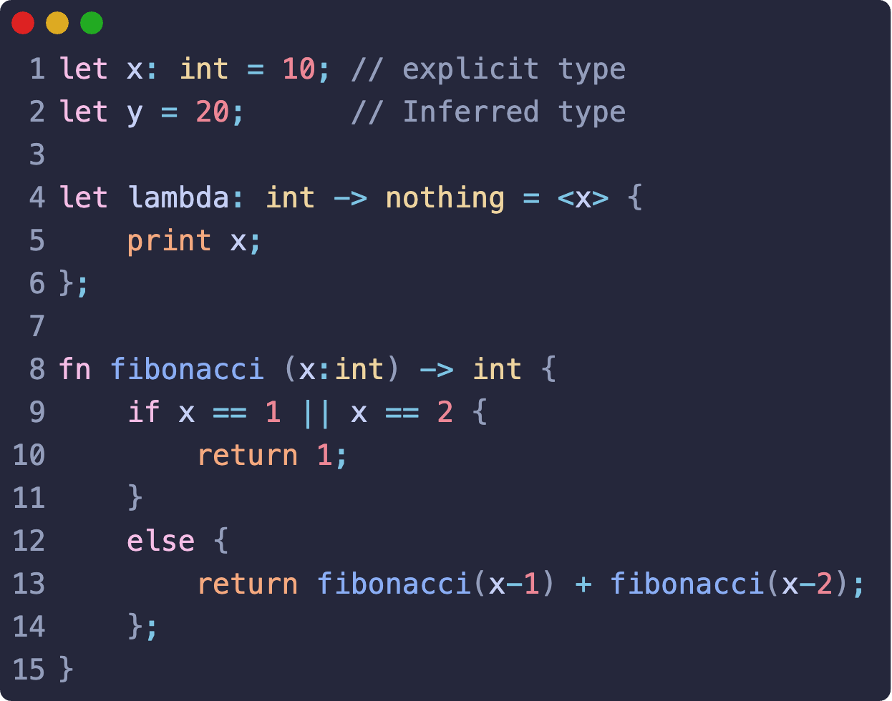
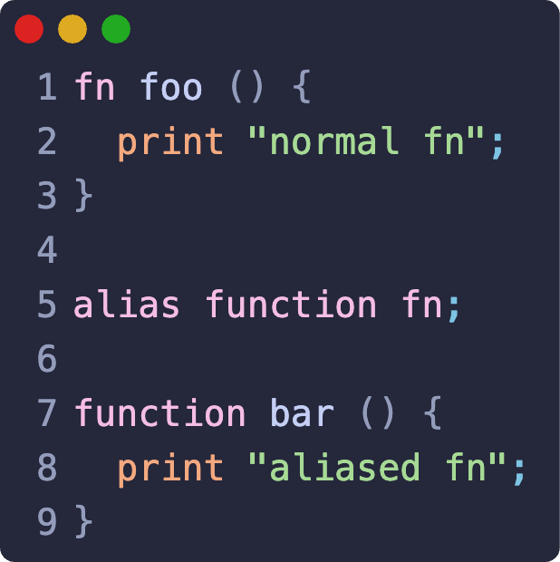

# Flavor

<!-- TODO: Update images -->

  
  

_Flavor_ is a programming language built to serve as a **learning platform** for
people interested in language development.

The structure of the project is based on the collaborative creation of a
programming language, _Flavor_, documented in a sort of diary ([the Book](https://mitra98t.github.io/Flavor/introduction.html)).

## Philosophy

Someone interested in language development could come and take a look at the
book to understand and follow the creation of a language.
Not only understanding how it works, but also understanding the reasoning behind the
implementation choices and hopefully learning something.
The Book serves to show the process behind the creation of a language showing
the challenges as they come up.

## Try Flavor!

For now, the code is described as a string in the `main.rs` file.
Simply run `cargo run` in the root of the repository to execute Flavor.

## Code Style

- Follow the existing code style and conventions.
  - I'm using the normal Rust notation validated by [clippy](https://github.com/rust-lang/rust-clippy)
- Include comments where necessary.
- Use the issue tracker to report bugs or request features.
- Provide detailed information and steps to reproduce issues.

## Contribution Guidelines

Thank you for your interest in contributing to this project! To ensure a smooth
collaboration, please follow these guidelines:

### How to Contribute

1. **Fork the repository and create your branch** from main:
   `git checkout -b feature/your-feature`
2. **Make your changes** with clear commit messages.
3. **Test your changes**.
4. **Submit a Pull Request** describing your changes and why they are needed.

### Pull Request Process

- Ensure your PR targets the main branch.
- Include tests if applicable.
- Keep your PR focused on a single issue or feature.
- Be responsive to feedback and update your PR accordingly.

### Book Contributions

In the directory `./flavor_book/` you will find [the Book](https://mitra98t.github.io/Flavor/introduction.html).
To **contribute** to the book you will need to have [mdbook](https://rust-lang.github.io/mdBook/).
Mdbook is a website creator to build beautiful documentations website using
markdown file.

To successfully see the book while writing, you will need two plugins:

- [mdbook-callouts](https://crates.io/crates/mdbook-callouts) for the beautiful
  [obsidian style callouts](https://help.obsidian.md/callouts)
- [mdbook-codename](https://crates.io/crates/mdbook-codename) to display the
  file name or header in the code snippets
- [mdbook-footnote](https://github.com/daviddrysdale/mdbook-footnote) to allow
  for the usage of footnotes

Once everything has been installed, cd into the book directory and run `mdbook
serve --open` to see the book while writing.

To **build the book** just run `mdbook build` inside the `./flavor_book/`
directory.
This way you will update the `./docs/` folder which will be used in the pages.

### Code Contributions

In the `./src/` directory you will find the source code for **Flavor**.
To run the **Flavor** engine, simply run `cargo run` in the root directory
of the project.

> You will need to have [Rust](https://www.rust-lang.org/it) on your system and [Cargo](https://doc.rust-lang.org/cargo/) to manage the project.
